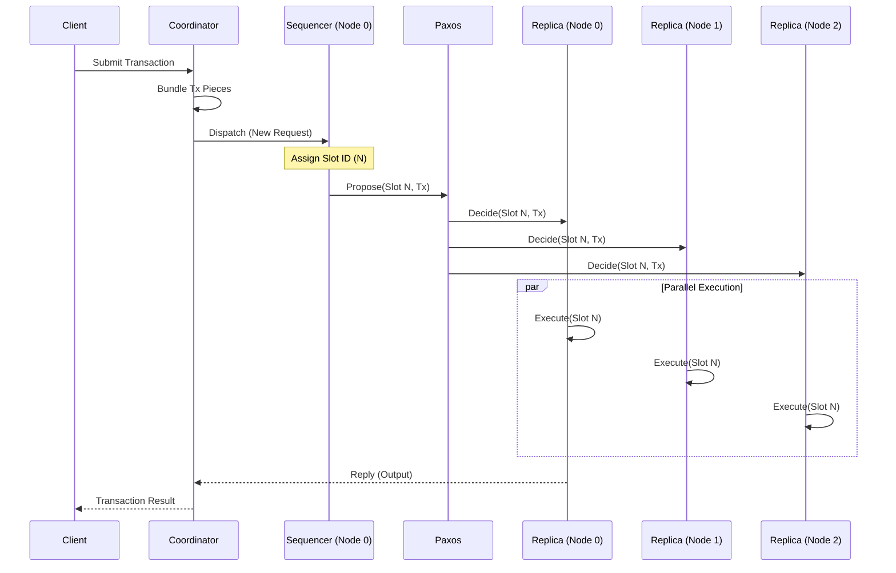

# Mako Deterministic Sequencer

This project implements a **Deterministic Sequencer** mode for the Mako distributed transaction processing system. It ensures strict serializability by ordering transactions globally before execution, using a designated sequencer and Multi-Paxos for consensus.

## Project Overview

The core idea is to remove non-determinism from distributed transaction execution. By establishing a total order of transactions upfront, replicas can execute them in the exact same order without complex locking or coordination during execution.

### Key Features
- **Deterministic Ordering**: Transactions are assigned a unique, monotonically increasing slot ID.
- **Global Sequencer**: Partition 0 (Site 0) acts as the global sequencer for ordering requests.
- **Multi-Paxos Consensus**: Ensures all replicas agree on the transaction order (slot assignment) even in the presence of failures.
- **Serial Execution**: Transactions are executed strictly in slot order, eliminating concurrency anomalies.

## System Architecture

### Transaction Lifecycle

The following diagram illustrates the flow of a transaction in the deterministic mode:



1.  **Submit**: Client sends a transaction request to the `CoordinatorDeterministic`.
2.  **Bundle**: Coordinator gathers all necessary data (transaction pieces) into a single payload.
3.  **Dispatch**: Coordinator forwards the payload to the **Sequencer** (always Partition 0, Site 0).
4.  **Order**: Sequencer assigns the next available **Slot ID**.
5.  **Consensus**: Sequencer uses **Multi-Paxos** to replicate the (Slot ID, Transaction) pair to all replicas.
6.  **Execute**: All replicas receive the ordered transaction and execute it strictly in slot order (waiting for Slot N-1 to finish before starting Slot N).
7.  **Reply**: The result is returned to the client.

## Implementation Details

The implementation resides primarily in `src/deptran/deterministic/`.

### 1. Coordinator (`CoordinatorDeterministic`)
- **Role**: Handles client transaction requests.
- **Logic**: Bundles all pieces of a transaction into a single request and forwards it to the Sequencer.
- **File**: `src/deptran/deterministic/coordinator.cc`

### 2. Scheduler (`SchedulerDeterministic`)
- **Role**: The core engine for ordering and execution.
- **Sequencer Logic**: Receives requests, assigns Slot IDs, initiates Paxos.
- **Replica Logic**: Receives ordered Txs from Paxos, queues them, and executes serially.
- **Optimization**: Heavily optimized to remove debug I/O overhead from the hot path.
- **File**: `src/deptran/deterministic/scheduler.cc`

### 3. Frame (`DeterministicFrame`)
- **Role**: Registers the "deterministic" mode and handles object creation.
- **File**: `src/deptran/deterministic/frame.cc`

## Configuration Guide

The system is configured via YAML files (e.g., `bench_det_1P-3Rep_new_order.yml`). Key sections include:

```yaml
mode:
  cc: deterministic       # Concurrency Control mode
  ab: multi_paxos         # Atomic Broadcast protocol
  batch: false            # Batching (keep false for deterministic mode)
  ongoing: 1              # Concurrency (keep 1 for strict serial execution)

site:
  server:
    - ["s1:18101", "s2:18102", "s3:18103"] # Define replicas for Partition 0
  client:
    - ["c1:18100"]        # Define client processes
```

- **`site.server`**: Defines the topology. Each list represents a partition. For 1-Partition 3-Replicas, use a single list with 3 addresses.
- **`ongoing`**: Controls client-side concurrency. Since deterministic execution is serial, increasing this may not improve performance and can cause contention.

## How to Compile and Run

### Prerequisites
- Linux environment
- Python 3
- `waf` build system (included)

### Compilation
```bash
python3 waf configure
python3 waf build
```

### Running Benchmarks

#### 1. 1-Partition, 1-Replica (Baseline)
Runs a single server node. No consensus overhead.
```bash
./run.py -f bench_det_1P-1Rep_new_order.yml -d 60
```
*Expected Performance: ~390+ TPS*

#### 2. 1-Partition, 3-Replicas (Paxos Enabled)
Runs three server replicas using Multi-Paxos.
```bash
./run.py -f bench_det_1P-3Rep_new_order.yml -d 60
```
*Expected Performance: ~200+ TPS*

